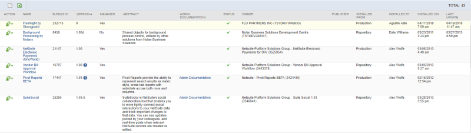

# Uninstalling Flashlight

Here is how to uninstall the Flashlight bundle from your account:

1. From the NetSuite main menu, hover over **Customization** > **SuiteBundler** > **Search & Install** > **List**
2. Locate the Flashlight bundle in installed bundle list.
3. Hover over the icon in the **Action** column and click **Uninstall**

   
4. Follow the standard procedure in NetSuite to remove the bundle.