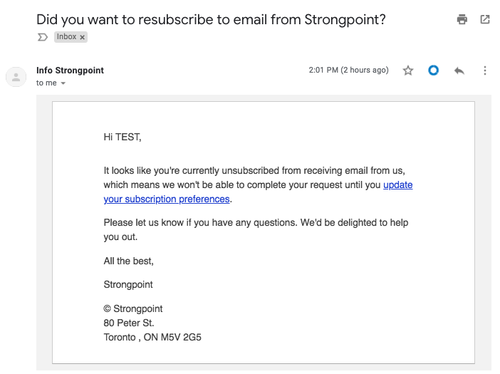

# Release Note Notifications

## Notifications

If you are not receiving release note notifications, you are likely not subscribed to **HubSpot**. You can also check your Spam folder to ensure Strongpoint messages are not being filtered. To subscribe or re-subscribe:

1. Open [www.strongpoint.io/subscription](https://www.strongpoint.io/subscription "Subscribe to receive Release Note notifications.")
2. Enter your information on the form. Click **Submit**.  
   If this is a new subscription, a confirmation is displayed. You're done!
3. If you previously unsubscribed, this link is displayed:  
   *Looks like you've opted out of email communication. Click here to get an email and opt back in.*
4. Click on the link. An email is sent to enable you to update your subscription preferences:

   
5. Click *update your subscription preferences*.
6. Click **Yes, resubscribe me!**  
   You can opt out of the Marketing Information and still receive the Release Note notifications.