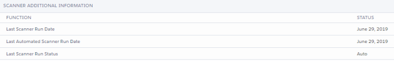

# Viewing the Status Report

The Configuration and Stats report is a live update on the status and results of the Strongpoint Automated Documentation system.

Open **Flashlight** > **Support** > **Status Report**

Click **Download PDF** to create a PDF file of the current status.

The report is divided into these sections:

> [Scanner Status Overview](#Scanner)
>
> [Documentation Stats](#Document)
>
> [Scanner Logs](#Scanner2)
>
> [Scanner Additional Information](#Scanner3)

## Scanner Status Overview

This section displays the current status of the scanners. You can click to manually **Start** a scanner or to **Stop** a running Scanner.

## Documentation Stats

This section displays the current status of the documentation Strongpoint has created for your account. The statistics included the total number of customization, and the various **joins** Strongpoint has created to track the relationships between customizations. **Joins** represent critical relationship information to help you determine if it is safe to delete or change something, and how it affects other items.

## Scanner Logs

The section displays details for each of the scanner logs:

* **Scanner Log Name**
* **Salesforce Type**
* **Retrieved Stage**: this column displays the current status when a scanner is running. For example, **DeDuplicate** is displayed if the scanner is running the **DeDuplicate** process during the scan.
* **Total Customization**: this column shows the number of customizations processed while a scanner is running. When the scan is complete, the column matches the total **Scanner Count**.
* **Scanner Count**

## Scanner Additional Information

This section displays each scanner function and the status:

* Last Scanner Run Date
* Last Automated Scanner Run Date
* Last Scanner Run Status

