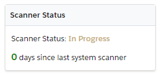
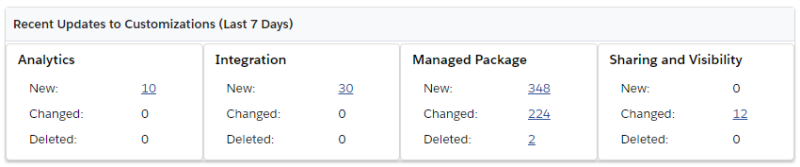
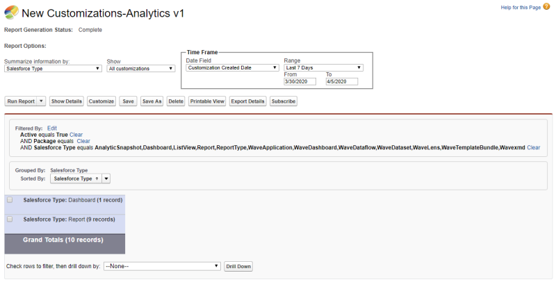
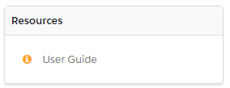
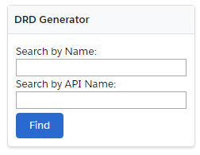

# Using the Dashboard

Flashlight comes with a comprehensive dashboard with everything to manage your org at your fingertips. The dashboard provides key tools and reports to enable you to take full control of your org and action problematic areas as required.

* [Scanner Status](#spider_status)
* [Recent Updates to Customizations](#Recent)
* [Resources](#resources)
* [Key Tools](#key_tools)
* [DRD Generator](#erd_generator)

## Scanner Status

Displays the current status of the scanner (Not Started, In Progress, Completed) and the number of days since the scanner was last run. It is recommended to run the scanner every week so your org documentation is up-to-date.  

## Recent Updates to Customizations

Displays the number of New, Changed, and Deleted Customizations over the past seven days. 

Click on number to drill down into a Report for more information. For example, here is the report for the 10 New Analytics Customizations:  

## Resources

Links to key resources to help you learn to use Flashlight.

## Key Tools

Links to useful Flashlight tools to give you more value out of your documentation.

* **DRD**: Explore your customizations with Flashlight’s visual DRD and understand how customizations relate to each other.
* **Finder**:[Find](../tools/finder "Open the Finder topic") standard and customized objects created by the scanner.
* **Export Objects**: Open the [Export Objects](../tools/export_objects "Open the Export Objects topic") tool.

## DRD Generator

A shortcut to open the DRD for the entered **Name** or **API Name**.  

**Next Step:** [Viewing the Status Report](config_and_stats "Open the Viewing the Status Report topic")