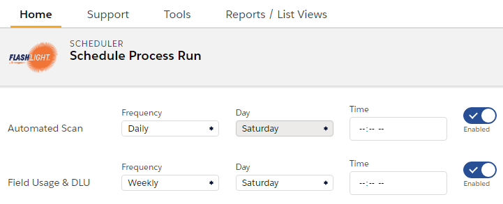

# Running the Scheduler

Strongpoint's scheduler creates automated scans and documents the Field Usage and date last used (DLU).

To use the scheduler tool:

1. Open **Flashlight** > **Support** > **Scheduler**
2. Toggle **Enabled**/**Disabled**by the category. Your selections are automatically saved.
3. Select the **Frequency** , **Day** and **Time**. Your selections are automatically saved.
4. Click any menu item to close the **Scheduler**.