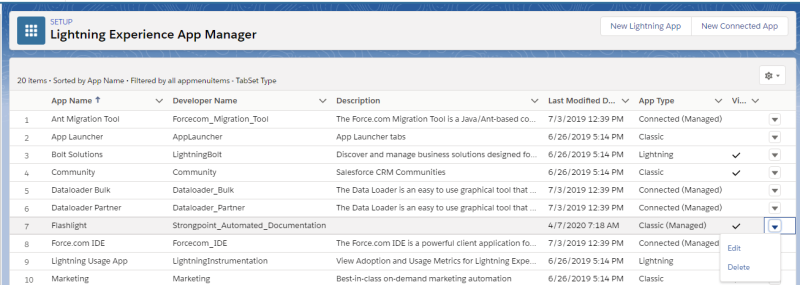

# Uninstalling Flashlight

Here is how to uninstall the Flashlight app from your org:

1. Open **Setup** from the Salesforce main menu.
2. Select **Apps** > **App Manager**
3. Locate **Flashlight** in the installed list.
4. Click the Action icon on the far right of the Flashlight entry and click **Delete**

:::note
NOTE: Once you uninstall the Flashlight app you must email flashlight@strongpoint.io to ensure you are not billed again. If you cancel within 48 hours of your next scheduled billing, you may be charged and then refunded
:::