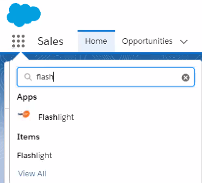

# Using the Getting Started Wizard

The Getting Started Wizard is available after you have installed the Flashlight [app](installing_flashlight "Open the Installing Flashlight topic").

To use the Getting Started Wizard:

1. Open the Salesforce **App Launcher** and select **Flashlight**.  
   
2. Click on the **Flashlight** tab to open the Flashlight homepage.
3. Open **Support** > **Getting Started Wizard**
  
4. Click **Run Scanner** to start the process.  
   
5. Click **Next**.
6. Click **Done**.

Flashlight for Salesforce examines your org and begins the automated documentation process. The process runs in the background. You receive an email notification when it is finished. The length of time depends on the size of your org.

**Next Step:** [Using the Dashboard](dashboard "Open the Using the Dashboard topic")