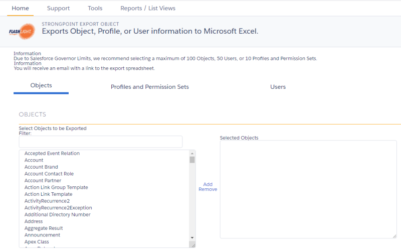
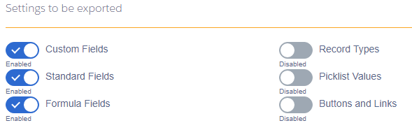
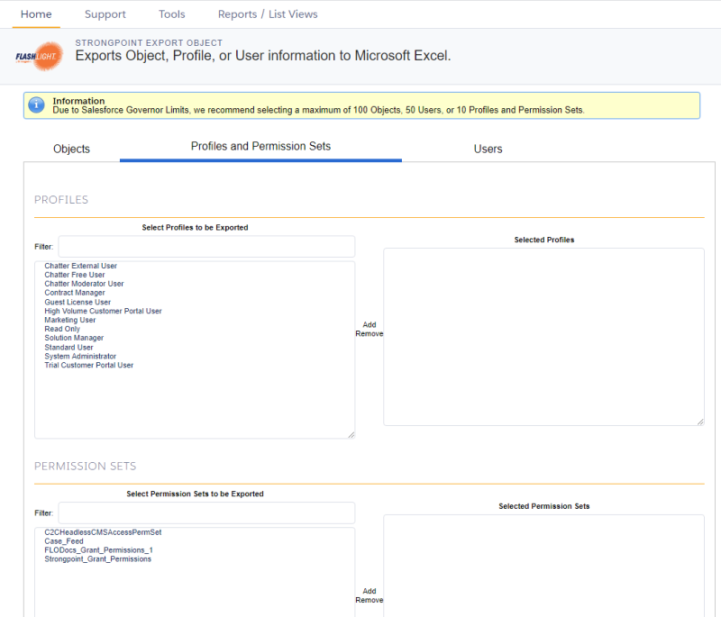
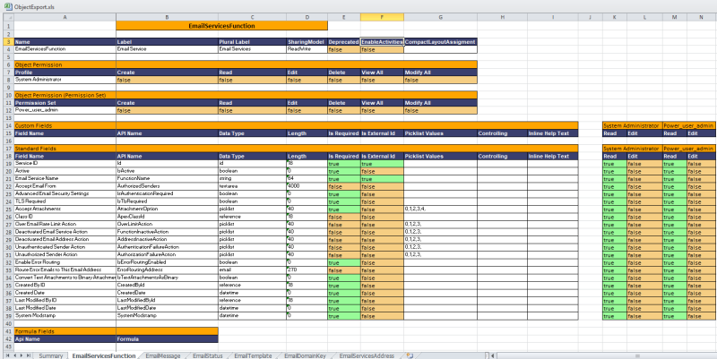

# Export Objects

Administrators can use this to export one or more objects, including all child objects, into a single view for easy review and management. For each export, you select the settings and optional profiles and permission sets to include in the object details. The export is done in the background to avoid timing out or exceeding the Salesforce Governor Limits. You will receive an email with a link to the [Export Object Attachment](export_object_attachment_records "Open Export Object Attachment record") record, where you can download your file.

:::note
NOTE: Strongpoint stores Object-level permissions in a Custom Object. There are two reports (Flashlight > Reports / List Views > Customizations) for easy access to this information:Permissions by ObjectObject Permissions by Profile
:::

1. Open **Flashlight** > **Tools** > **Export Objects**  
   **Objects** is the default tab. **Profiles and Permission Sets** and **Users** exports are on their own tabs.
2. Scroll through the **Select Objects to be Exported**, or enter all or part of a name in **Filter** to filter the list.
3. Select one or more objects in the scroll box. Use **Shift** or **Ctrl** to select multiple objects.
4. Click the right arrow to move the items to the **Selected Objects** list. To remove an item from the **Selected Objects** list, select it and click the left arrow.
5. Select the **Settings to be exported**.  
   
6. Optional: Select one or more profiles to be included for more security information.
7. Optional: Select one or more permission sets to be included for more security information.
8. **Click Download XLS** to export your selections. The file *ObjectExport.xls* is created in your download folder.

### ObjectExport.xls File

When you open an exported file, this message may be displayed, as the exported *ObjectExport.xls* file is in XML instead of the Excel format. Click **Yes** to load the file.

The *ObjectExport.xls* file contains a **Summary** tab and a separate tab for each selected object.

The **Summary** tab shows who created the export, the creation date and time, list of selected objects, and lists of any selected optional Profiles and Permission Sets.  

The **Object** tabs contain all of the requested information for each object.