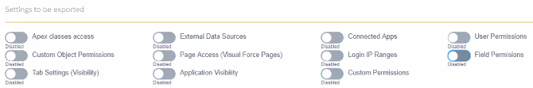
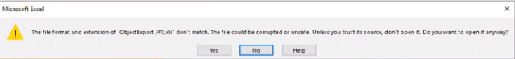

# Export Profiles and Permission Sets

Administrators can use this tool to export all user permissions into a single view for easy review and management. The export is done in the background to avoid timing out or exceeding the Salesforce Governor Limits. You will receive an email with a link to the [Export Object Attachment](export_object_attachment_records "Open Export Object Attachment record") record, where you can download your file.

1. Open **Flashlight** > **Tools** > **Export Objects**.
2. Open the **Profiles and Permission Sets** tab.  
   
3. Scroll through the **Select Profile to be Exported**.
4. Select one or more objects in the scroll box. Use **Shift** or **Ctrl** to select multiple objects.
5. Click the right arrow to move the items to the **Selected Profiles** list. To remove an item from the **Selected Profiles** list, select it and click the left arrow.
6. Select the **Settings to be exported**.  
   
7. Click **Test Connection**.
8. Click **Download XLS**. The file *ProfileExport.xls* is created.

### ProfilesExport.xls File

When you open an exported file, this message may be displayed, as the exported *ProfilesExport.xls* file is in XML instead of the Excel format. Click **Yes** to load the file.

The *ProfilesExport.xls* file contains a **Summary** tab and a separate tab for each selected profile.

The **Summary** tab shows who created the export, the creation date and time, and the list of selected profiles.  

The **Profile** tabs contain all of the requested information for each profile. 