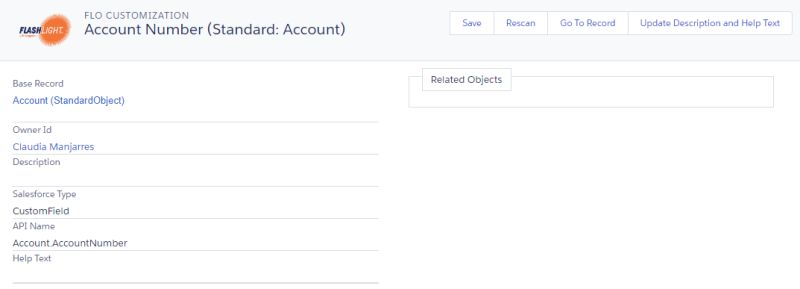

# Running the Scanner

When the initial scan is complete, you can run additional on demand scans as required.

When you add or change a specific customization, you can choose to run an on demand scan of only the Metadata type of the affected customization, instead of scanning the entire environment. This type of scan reduces the run time. For example if you change a Report, pick reports as the Metadata type and Strongpoint only scans reports.

:::note
NOTE: The scanner is only available to Administrators.
:::

To run the scanner:

1. Open **Flashlight** > **Tools** > **Strongpoint Scanners**
2. Optional: You can enter all of part of a **Type** in **Search Types** to filter the list.
3. You can select several types to scan or you can scan the whole environment by clicking the **+** by **Name** to select all the types.
4. Click **Run Scanner**.
5. The batch runs in the background. You receive an email notification when the scan is complete.
6. You can open **Flashlight** > **Support** > **Status Report** to view the **Flashlight Configuration and Stats**.

If you are missing objects, you can run a scan on a **Customization** from the open record by clicking **Rescan**.

**Next Step:**[Validating the Data](validating_data "Open the Validating the Data  topic")