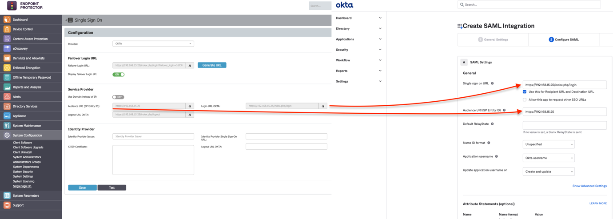
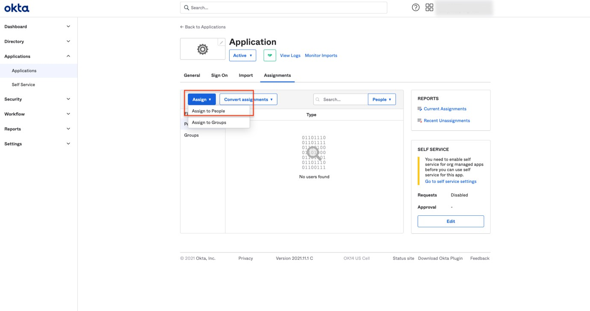
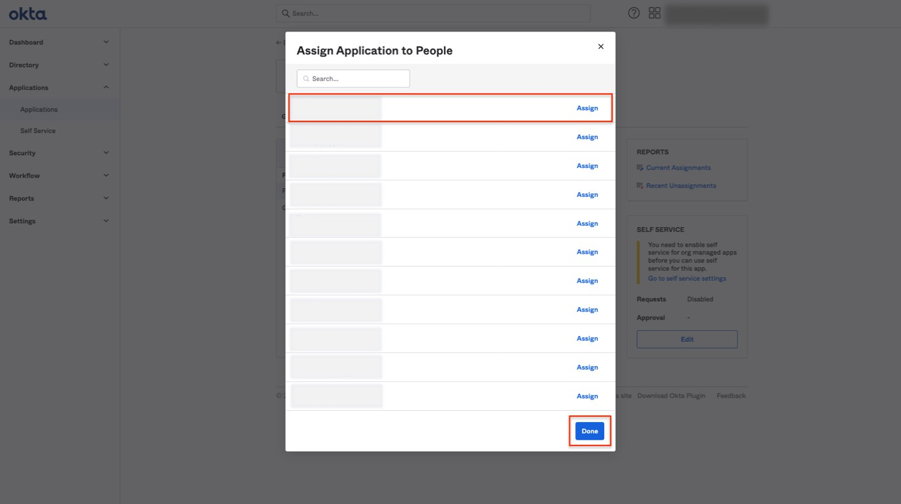
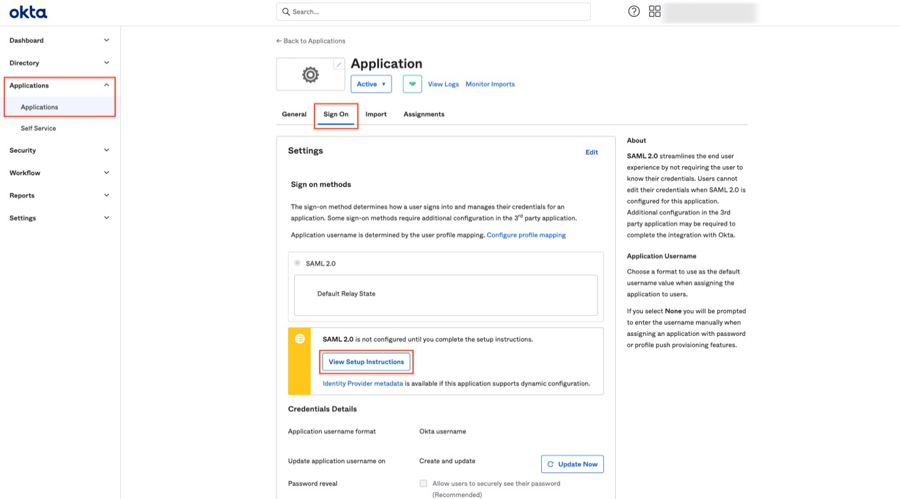

# Single Sign On (SSO) Configuration with Okta

Single Sign On (SSO) is a powerful authentication process that enhances security and improves user experience by allowing users to access multiple applications with a single set of login credentials. In this guide, we focus on configuring SSO using Okta, a leading identity management service, to streamline user access and secure your system effectively.

## Configuring SSO with Okta

Configuring Single Sign-On with Okta involves several key steps that integrate your server with Okta’s authentication framework. Begin by activating SSO within your system’s configuration settings, selecting a failover user, and preparing for provider selection. This section will guide you through the precise steps required to establish a secure and efficient SSO connection, including application integration in Okta, SAML settings configuration, and the necessary data synchronization between your server and Okta. Follow the steps below to ensure a successful setup.

__Step 1 –__ To activate Single Sign-On, navigate to __System Configuration__ > __System Settings__ > __Single Sign-On__. Once activated, select a Failover Login User from the drop-down menu. The Root user is selected by default.

After completing the above steps, a Single Sign-On subsection will appear in the System Configuration section.

__Step 2 –__ Select the __Provider__ in order for Single Sign On subsection to be displayed.

__Step 3 –__ Go to yourcompany.okta.com, select __Applications__, and then click __Create App Integration__.

__Step 4 –__ On the next screen, select __SAML 2.0__ and click __Next__.

__Step 5 –__ Set a __Name__ for the Application and click __Next__.

__Step 6 –__ Open the __Configure SAML__ tab.

__Step 7 –__ Go to your Endpoint Protector __Server__, __System Configuration__, Single Sign On.

__Step 8 –__ Copy the information from:

- Audience URI (SP Entity ID) and paste it on the field with the same name from OKTA, Configure SAML.
- Login URL OKTA and paste it on the field Single sign on URL from OKTA page, Configure SAML.

__Step 9 –__ On the OKTA page, click __Show Advanced Settings__.

__Step 10 –__ Edit the following fields:

- Signature Algorithm, select __RSA-SHA1__
- Digest Algorithm, select __SHA1__

__Step 11 –__ Hide Advanced Settings and click __Next__.

__Step 12 –__ At step 3, select an answer for each question and click __Finish__.

__Step 13 –__ Navigate to __Applications__, select the Endpoint Protector application, go to Assignments, and assign people to the application.

__Step 14 –__ After assigning the accounts, click __Done__.

__Step 15 –__ Navigate to Applications, open the created app and click __Sign On__, __View Setup Instructions__.

__Step 16 –__ From the new opened section, copy the needed information and paste it on your Endpoint Protector Server:

- Identity Provider Single Sign-On URL to Endpoint Protector Server, System configuration, Single Sign On, Identity Provider Single Sign-on URL
- Identity Provider Issuer to Endpoint Protector Server, System configuration, Single Sign On, Identity Provider Issuer
- X.509 Certificate to Endpoint Protector Server, System configuration, Single Sign On, X.509 Certificate

__Step 17 –__ __Save__ the settings on your Endpoint Protector Server and click __Test__ to confirm configuration settings are correct.
