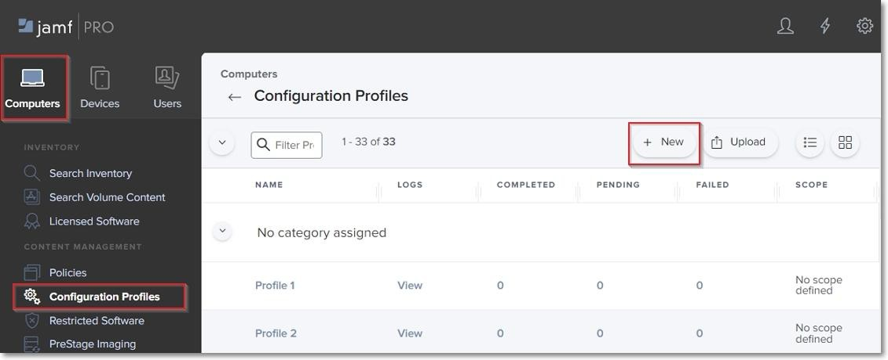
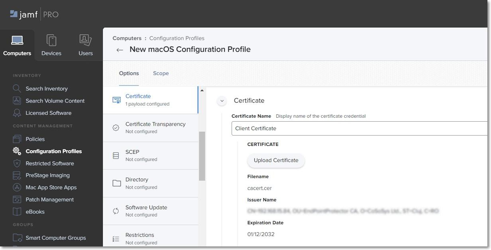
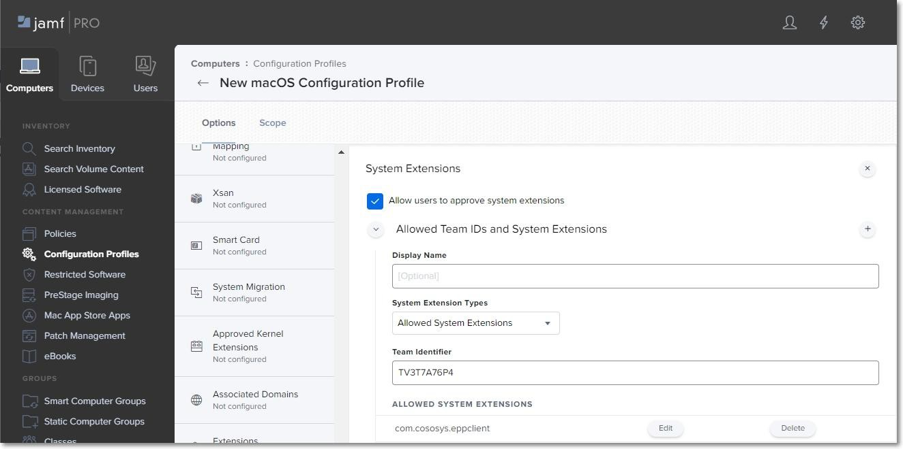
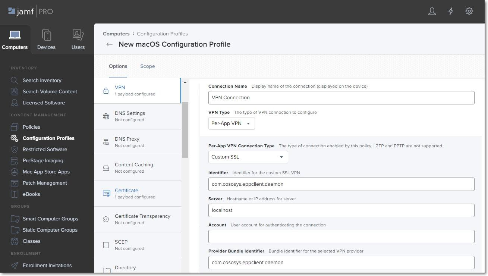

# Creating the Configuration Profile

In order to use Jamf, first, you need to create a new configuration profile. To do so, follow these steps:

__Step 1 –__ Open the Jamf Pro account and log in using your credentials.

__Step 2 –__ In your Jamf account, from the main navigation bar click __Computer__, and then from the left sidebar menu, select __Configuration Profiles__.

__Step 3 –__ To create a new configuration profile, in the upper right, above the table with available configuration profiles, click __+New__.



On the New macOS Configuration Profile section, you can manage profile settings and select the devices and users to which you want to deploy the profile.

__NOTE:__ Click __Save__ only once you have managed all settings and the profile scope.

## General Settings

On the default General section, enter the following information:

- Name – enter a name to use for this configuration profile.
- Description (optional) – add a description that details the purpose of the configuration profile.

You can continue with the default settings for the category, level, and distribution method fields.


## Certificate Settings

You will add the Client CA Certificate in .cer format on the Certificate settings section.

__NOTE:__ This step is not required if you are not using Deep Package Inspection. To continue the process, go to the Privacy Preferences Policy Control section.

__Step 1 –__ Log in to Endpoint Protector Server, go to the System Configuration section, and then select __System Settings__.

__Step 2 –__ On the Default System Settings section, enable Deep Packet Inspection Certificate and then download Client CA Certificate – the downloaded .zip file contains the .cer and .crt client certifications.


__Step 3 –__ Go to Jamf, the Certificate section, and click __Configure__.

__Step 4 –__ Enter a Certificate name and then select and upload the downloaded Client CA Certificate in .cer format.



## Privacy Preferences Policy Control Settings

On the Privacy Preferences Policy Control section, click __Configure__ and then enter the following information:

- Identifier - ```com.cososys.eppclient```.
- Identifier Type – go with the default Bundle ID type.
- Code Requirement

```anchor apple generic and certificate 1[field.1.2.840.113635.100.6.2.6] /* exists */ and certificate leaf[field.1.2.840.113635.100.6.1.13] /* exists */ and certificate leaf[subject.OU] = TV3T7A76P4```.

__NOTE:__ Use the Terminal Editor to verify there are no formatting alterations before executing this command line.

- Select the __Validate the Static Code Requirement__ check-box.
- Click __Add__ and __Save__ to allow access to SystemPolicyAllFiles and Accessibility services.


## Allow EppNotifier Settings

On the Privacy Preferences Policy Control section, click the __+ icon__ to add a new policy and then enter the following information:

Identifier - ```com.cososys.eppclient.notifier```

Identifier Type – go with the default Bundle ID type.

Code Requirement

```anchor apple generic and certificate 1[field.1.2.840.113635.100.6.2.6] /* exists */ and certificate leaf[field.1.2.840.113635.100.6.1.13] /* exists */ and certificate leaf[subject.OU] = TV3T7A76P4```.

__NOTE:__ Use the Terminal Editor to verify there are no formatting alterations before executing this command line.

- Select the __Validate the Static Code Requirement__ check-box.
- Click __Add__ and then __Save__ to allow access to Accessibility services.


## Enforced Encryption Settings

On the Privacy Preferences Policy Control section, click the __+ icon__ to add a new policy and then enter the following information:

Identifier – ```com.cososys.easylock```.

Identifier Type – go with the default Bundle ID type.

Code Requirement

```anchor apple generic and certificate 1[field.1.2.840.113635.100.6.2.6] /* exists */ and certificate leaf[field.1.2.840.113635.100.6.1.13] /* exists */ and certificate leaf[subject.OU] = TV3T7A76P4```.

__NOTE:__ Use the Terminal Editor to verify there are no formatting alterations before executing this command line.

- Select the __Validate the Static Code Requirement__ check-box.
- Click __Add__ and then __Save__ to allow access to SystemPolicyAllFiles and Accessibility services.


## System Extension Settings

### Allow System Extensions

On the System Extension section, click __Configure__ and then enter the following information:

- Display Name (optional) - enter a name to use for this configuration.
- System Extension Type - select __Allow System Extension type__.
- Team Identifier - ```TV3T7A76P4```.
- Allowed System Extensions – click __Add__, enter ```com.cososys.eppclient```, and then __Save__ the changes.



__NOTE:__ For operating systems lower than macOS 11 (Big Sur), manage settings from the Approved Kernel Extensions section instead of System Extensions. Define the Team ID (enter TV3T7A76P4) and proceed to the next step.

### Removable System Extensions

On the System Extension section, click the __+ icon__ to add a new policy that will allow removing system extensions without a pop-up, and then enter the following information:

- Display Name (optional) - enter a name to use for this configuration.
- System Extension Type - select __Removable System Extensions__ type.
- Team Identifier - ```TV3T7A76P4```.
- Allowed System Extensions – click __Add__, enter ```com.cososys.eppclient```, and then __Save__ the changes.

__NOTE:__ This setting will be applied starting with MacOS 12 version (Monterey).


### Managed Login Items

Administrators can quickly disable Endpoint Protector Items in Jamf Configuration Profiles with Ventura's (macOS 13) new capability. This can be accomplished by taking the following steps:

__Step 5 –__ Log in to your Jamf account.

__Step 6 –__ Click __Computer__ from the main navigation bar.

__Step 7 –__ Select __Configuration Profiles__ from the sidebar menu on the left.

__Step 8 –__ Click __New__ in the upper right-hand corner.

__Step 9 –__ On the left, under the Options box, select __Managed Logged In Items__.

Endpoint Protector Items can be simply disabled in your Jamf Configuration Profiles from here. Simply uncheck the box next to the Endpoint ProtectorItem(s) you want to disable, and then click __Save__ to save your changes.

__NOTE:__ Disabling Endpoint Protector Items may have an impact on the security of your system. Only disable these items if you are positive it is essential and you have taken every precaution necessary to keep your system secure.

## VPN Settings

__NOTE:__ This step is not required if you are not using VPN services. To continue the process, go to the Scope section.

On the VPN section, click __Configure__ and then enter the following information:

- Connection Name – enter a connection name that will be displayed on the device.
- VPN Type – select __Per-App VPN__ type.
- Per-App VPN Connection Type – select __Custom SSL connection__ type.
- Identifier – com.cososys.eppclient.daemon.
- Server – localhost.
- Provider Bundle Identifier – com.cososys.eppclient.daemon.
- Provider Type – select __App-proxy__ type.
- Select the __Include All Networks__ check-box.
- Provider Designated Requirement

```anchor apple generic and certificate 1[field.1.2.840.113635.100.6.2.6] /* exists */ and certificate leaf[field.1.2.840.113635.100.6.1.13] /* exists */ and certificate leaf[subject.OU] = TV3T7A76P4```

__NOTE:__ Use the Terminal Editor to verify there are no formatting alterations before executing this command line.

- Select the __Prohibit users from disabling on-demand VPN settings__ check-box.




## Notifications Settings

__NOTE:__ This step is optional. To continue the process, go to the Scope section.

On the Notifications section, click __Configure__ and then enter the following information:

- App Name - ```EppNotifier```.
- Bundle ID - ```com.cososys.eppclient.notifier```.
- Toggle the switch to include the settings type and then disable/enable to manage each notification option.


## Scope

Once you manage all settings, go to the Scope tab and select the devices and users to deploy the new profile.

Click __Save__ to apply all settings to the new configuration profile.

__NOTE:__ To confirm that the new configuration profile is saved successfully, reboot your computer at this point.


