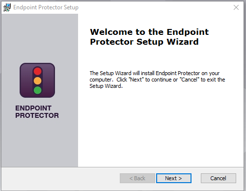
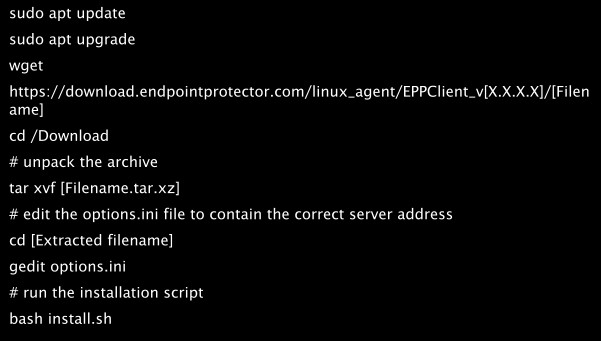

# Agent

The Endpoint Protector Agent enforces the Rights and Settings received from the Endpoint Protector Server on the protected endpoints (Windows, Mac, and Linux).

You can download the Endpoint Protector Agent directly from the Endpoint Protector UI. For detailed information about downloading the Endpoint Protector Agent, refer to the [Client Software](../../admin/systemconfiguration/overview.md#client-software) topic.

__NOTE:__ You can use tools like Active Directory or JAMF to deploy the Endpoint Protector Agent in large networks.

__NOTE:__ Starting with Endpoint Protector Server version 5.8.0.0, an additional security feature is available to protect the integrity of the Agent. This feature, accessible via Device Control on the Global Settings page, is known as the Tamper Mode setting. It is designed to prevent unauthorized termination or modification of the Endpoint Protector Agent.

## Agent Installation

For Windows and Mac, your input in installing the Endpoint Protector Agent is minimal. The Installation folder and Server information are already pre-configured, and downloadable from the Endpoint Protector Server.

__NOTE:__ For Linux installation instructions, read the readmeLinux.txt file available under the Read this before installing link.

__NOTE:__ You can also install the Agent from a repository for Endpoint Protector Linux Agents starting with version 1.4.0.4., as described in the topic below.

The following are several examples of supported distributions:

- Ubuntu 14.04+
- Mint 18.X
- CentOS 7.x
- Fedora 29
- OpenSUSE 42.2 and 42.3




### Installation on macOS with Deep Packet Inspection and VPN Traffic Intercept Active

Follow the steps to install on macOS with Deep Packet Inspection and VPN Traffic Intercept active.

__Step 1 –__ Open the Endpoint Protector Server.

__Step 2 –__ Go to the __System configuration__ section, select __Client Software__ and then download the macOS Endpoint Protector Agent.

__Step 3 –__ Decompress the downloaded file.


__Step 4 –__ Open the __.pkg__ file and follow the installation steps and give the requested permissions.

__Step 5 –__ After the installation is complete, go to __System Preferences__ > __Security & Privacy__ > __Privacy tab__ > __Full Disk Access__. Search for Endpoint Protector Client, select the checkbox, and then __save__ the changes.


__Step 6 –__ Open the Endpoint Protector Server and activate Deep Packet Inspection by navigating to __Device Control__ > __Users/Computer/Group/Global Settings__ > __Manage Settings__ > __Endpoint Protector Client__ > __Deep Packet Inspection__.


__Step 7 –__ Go to the __System Configuration__ section, then __System Settings__ > __Deep Packet Inspection Certificate__, and download the __CA Certificate__.


__Step 8 –__ Open the __Keychain Access__ application from your macOS and select __System__.


__Step 9 –__ Decompress the downloaded __ClientCerts__ file.

__Step 10 –__ Select __cacert.pem__ file and drag and drop it on __System > Keychain Access__.


__Step 11 –__ Double-click the __X__ on the newly added certificate and on the Trust section, select __Always Trust__.


__Step 12 –__ __Save__ the changes.

__Step 13 –__ Activate __Intercept VPN Traffic__.

__Step 14 –__ Select one option for __EPP behavior when network extension is disabled__.

- Temporarily Disable Deep Packet Inspection – this option will temporary disable Deep Packet Inspection
- Block Internet Access – this option will end the Internet connection until the end-user approves the Endpoint Protector Proxy Configuration once the computer is rebooted.


__Step 15 –__ __Save__ the changes.

__Step 16 –__ The following pop-up will be displayed informing the end-user that a System Extension is blocked and needs to be allowed.


__Step 17 –__ Go to __System Preferences__ > __Security and Privacy__ > select the __General tab__ and __allow__ the Endpoint Protector Client Extension.


__Step 18 –__ __Allow__ the Endpoint Protector Proxy Configuration from the pop-up window.


At this point, the macOS Endpoint Protector Client installation is completed.

__NOTE:__ If EPPNotifier is not visible or notifications do not display after the installation or upgrade of the Endpoint Protector Client on macOS, please resolve this issue by restarting your machine. In situations where the Endpoint Protector Client is installed and then uninstalled on macOS, you may still see EPPNotifier in the Notification settings. To remove it from the list, simply right-click and select "Reset notifications."

### Debian Based Distributions

While the installation process is similar, each distribution and version have their own particularities.

The following are several examples of supported distributions:

- Ubuntu 14.04
- Ubuntu 15.04
- Ubuntu 16.04
- Ubuntu 17.04
- Ubuntu 18.04
- Ubuntu 19.04
- Ubuntu 20.04
- Ubuntu 21.04
- Ubuntu 21.10
- Ubuntu 22.04
- LinuxMint
- Debian



### RedHat based distributions

While the installation process is similar, each distribution and version have their own particularities.

The following are several examples of supported distributions:

- CentOS 7.x
- RedHat 8.x
- Fedora 32, 33, 34, 35
- AWS Linux 2


- OpenSuse 15.2
- SUSE 15+
- SLED Linux Enterprise Server 15 SP1
- SLED Linux Enterprise Server 15 SP2
- SLED Linux Enterprise Server 15 SP3


### Setting the Server IP

For all RedHat-based distributions, you need to follow an additional step after executing the above commands in order to set the Endpoint Protector Server IP.

Based on each distribution, follow the corresponding method:


### The Windows Subsystem for Linux

The Windows Subsystem for Linux (WSL) allows you to run native Linux distributions directly within your Windows environment. However, due to its nature, the Endpoint Protector Client cannot be directly installed as an application within WSL.

While direct installation is not possible, you can still manage and control the usage of WSL applications through the Application Denylist feature in Endpoint Protector. This allows you to define specific applications or processes associated with WSL that you want to restrict and monitor.

Follow the steps to use use Denylists to control WSL applications.

__Step 1 –__ Navigate to the [Denylists and Allowlists](../../admin/denylistsallowlists/overview.md) section within the Endpoint Protector Console.

__Step 2 –__ Create a new __Denylist entry__.

__Step 3 –__ In the __Application Name field__, specify the WSL application you want to control. This could be:

- ```wsl *``` – This wildcard entry will match all WSL applications.
- ```wsl.exe``` – This entry will specifically target the ```wsl.exe``` executable.
- ```wsl.exe --help``` – This entry will target the specific command ```wsl.exe --help```.
- ```wsl --list```– This entry will target the ```wsl --list``` command.

__NOTE:__ Endpoint Protector Client cannot directly control the usage of WSL Bash command-line tools on Windows.
