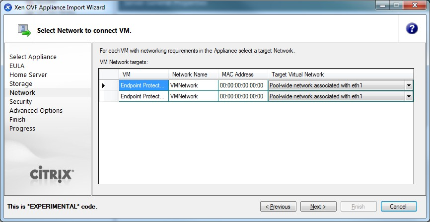

# Citrix XenServer

Citrix XenServer facilitates the import of virtual appliances using the OVF format, catering to enterprise-grade virtualization needs.

## Citrix XenServer

Citrix XenServer offers straightforward OVF imports for virtual appliances.

Follow the steps to get started with your deployment process.

__Step 1 –__ Unzip the downloaded package.

__Step 2 –__ Start XenCenter.

__Step 3 –__ Go to File and select __Appliance Import__.

__Step 4 –__ Select the OVF file and then click __Next__.

__Step 5 –__ Read and accept the EULA, then click __Next__.

__Step 6 –__ Select the target for the Virtual Appliance.

__Step 7 –__ Select the storage location.

__Step 8 –__ Select the network (keep default values).

__Step 9 –__ On the Security screen, click __Next__.

__Step 10 –__ On the Advanced Options screen, click __Next__.

__Step 11 –__ On the Finish screen, review the configuration, click __Finish__ and wait for the import to be completed.

The virtual machine is ready to be started.
