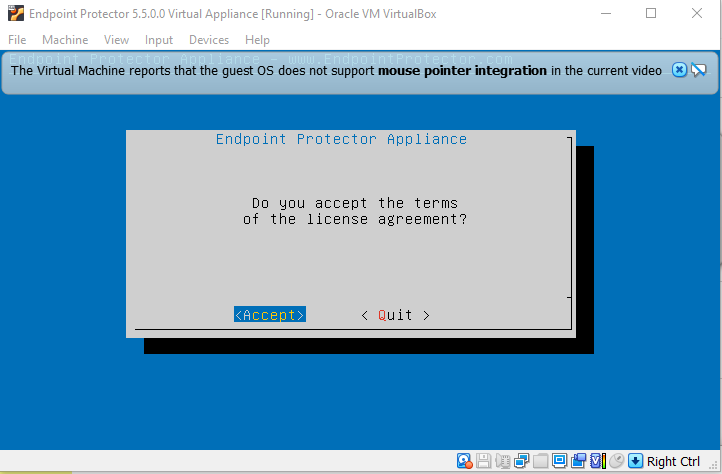
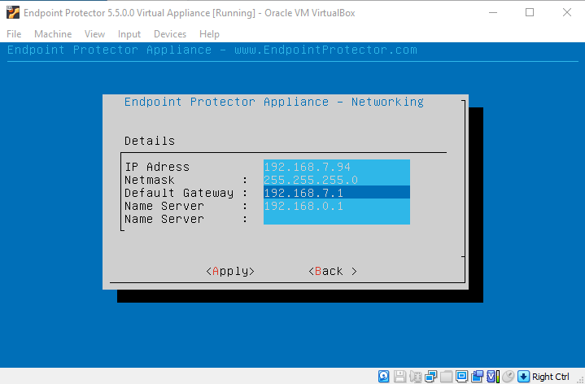

# Setup Wizard

The Endpoint Protector Appliance requires incoming traffic for ports 443 inbound to be whitelisted
from the firewall. They are used for:

- Endpoint Protector Server and Client communication: 443 inbound
- Live Update (liveupdate.endpointprotector.com): 80 & 443 outbound to this single address
  (178.63.3.86/32)

Follow the steps to configure the Endpoint Protector Appliance for the first time.

**Step 1 –** Select **Continue** when finished reading the End User License Agreement.

**Step 2 –** Select **Accept**.

**Step 3 –** Select **Networking**.

**Step 4 –** The configuration methods are now available.

**CAUTION:** We recommend a manual configuration of the network settings.

## Manual Configuration

For precise control, use manual configuration to set the IP address and default gateway, ensuring
the appliance is correctly set up and accessible.

**Step 1 –** Select **Configure Network manually** (recommended).

**Step 2 –** Set the IP Address, and Default Gateway (in our example we set the IP Address as
192.168.7.94 and the Default Gateway as 192.168.7.1).

**Step 3 –** Press **Tab**.

**Step 4 –** Select **Apply**. The virtual appliance is now accessible from the configured IP
Address. (e.g., https:// 192.168.7.94).

## Automatic Configuration

Select **configure network automatically**, and click **Enter**.

The IP Address and Default Gateway will be configured automatically.
