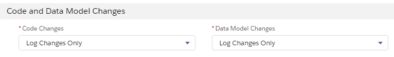
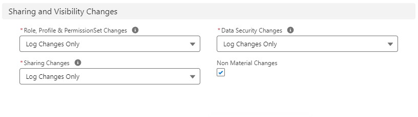
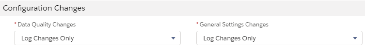
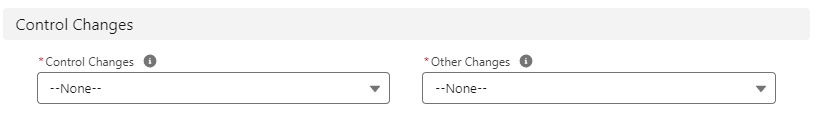
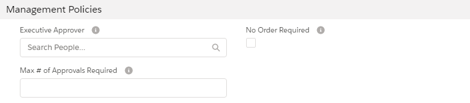
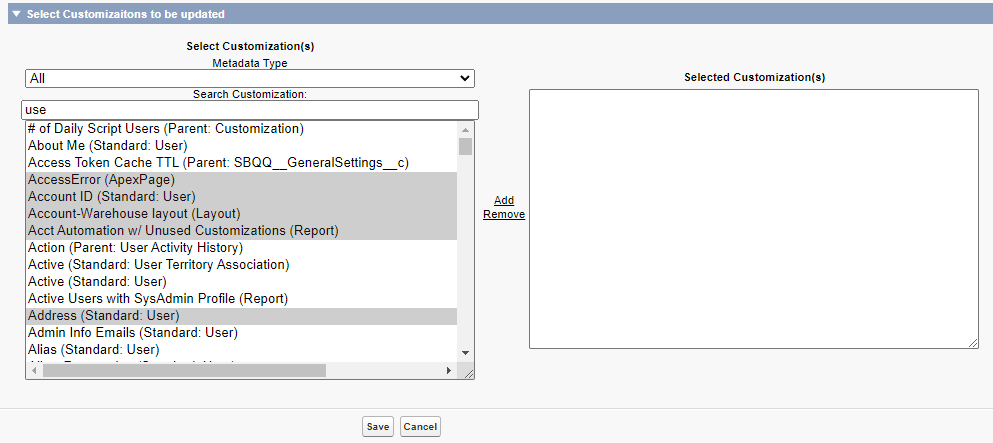
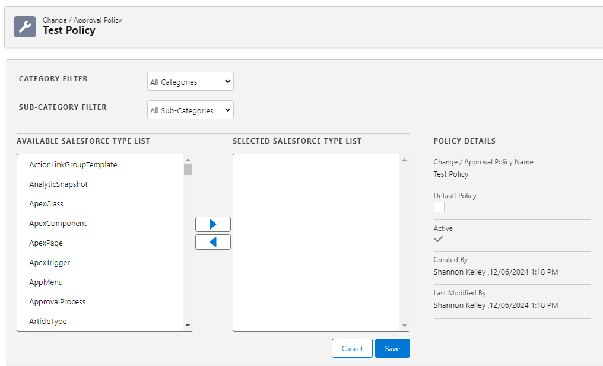
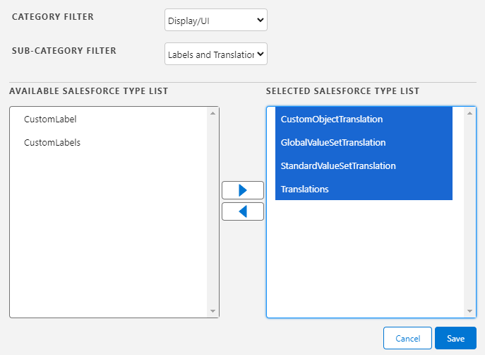

# Set Up Policies

Change / Approval Policies have two tabs: [Details](#Details) and [Related](#Related).

You can create a New Policy, or edit an existing one:

1. Expand the **Change / Approval Policies** tab.
2. Change the **Recently Viewed** pinned list to **All Policies** to see a list of existing policies.
3. Click  **New** to create a new policy or select an existing policy and click **Edit**.

## Details

> [Information](#Informat2) general information about the policy.
>
> [Code and Data Model Changes](#Code) change control level for code and data model changes.
>
> [Automation Changes](#Automati) change control level for approval process, business process, flow, workflow and process builder changes.
>
> [Sharing and Visibility Changes](#Sharing) change control level for role, profile, permission set, data security, sharing non material and indirect changes to profile changes.
>
> [Integration Changes](#Integrat) change control level for external site, identity, and access changes.
>
> [Configuration Changes](#Configur) change control level for data quality and general settings changes.
>
> [Display and UI Changes](#Display) change control level for application, label and translation, layout and template changes.
>
> [Analytics Changes](#Analytic) change control level for reports, dashboards, list view, and Einstein changes.
>
> [Control Changes](#Control) change control level for control changes.
>
> [Application Configuration Changes (Data)](#Applicat)
>
> [Health Check Changes](#Health "Health Check Changes") change control level for health check changes.
>
> [IT Policies](#IT%C2%A0Polic) preliminary and final approvers.
>
> [Customization Policies](#Customiz) impacted customization approval.
>
> [Management Policies](#Manageme) executive approver and approval settings.
>
> [Change Enablement Defaults](#Change) merge approval list, non conforming alerts, and sequential approval requests.
>
> **System Information**, **Created By** and **Last Modified By** dates. Informational only, cannot be edited.

Once the policy is saved, **System Information** is added show the **Created By** and **Last Modified By** user and time stamp. The information you entered on the form is shown on the **Details** tab. The [Related](#Related) tab is now available to add Customizations and view additional information and history.

### Information

* **Change/Approval Policy Name**
* **Default Policy**: Check if this is the default change/approval policy.
* **Parent Policy**: Search and add a parent policy (if applicable).
* **Active**: Check if the policy is active.

Set the required Change Level for each Metadata Type. The Default is shown in the form.

| **Change Level** | **Description** |
| --- | --- |
| **Log Changes Only** | Since the system automatically logs all changes, this change level requires no actions for compliance. Any changes to these objects are automatically marked compliant. |
| **Change Request** | Any changes to these objects require an Approved Change Request. |
| **Sandbox Development & Testing** | Any changes to these objects require an Approved Change Request in the Stage Development Project. It also requires that a parent Change Request is attached to the Development Project. |
| **Full Software Development Lifecycle** | Any changes to these objects require an Approved Change Request. |

### Code and Data Model Changes

### Automation Changes

### Sharing and Visibility Changes

### Integration Changes

### Configuration Changes

### Display and UI Changes

### Analytics Changes

### Control Changes

Controls the change level required for different types of changes. Health Check Changes affect the way changes are handled for the customization records for each Salesforce Health Check group (session settings, file upload and security settings), so you can track and report on current settings. There is a [Health Settings](../customizations/understanding_customization_record#Health "Jump to the Customization Record topic") tab for the specific records on the customization record.

### Application Configuration Changes (Data)

")

Set objects and fields that are **Tracked Non-blocking** or **Tracked Blocking** to be part of the policy and require a Ticket and an approval.

Refer to [Set Up Data Tracking](set_up_data_tracking "Set Up Data Tracking") for more information on activating and validating tracked fields.

### Health Check Changes

Select the change level for **Health Check Changes**: **None**, **Log Changes Only**, **Change Request**, **Sandbox Development & Testing**, or **Full Software Development Lifecycle**.

### IT Policies

Specify the **Preliminary Approver**. Enter part of the name to see a matching list. For critical changes, you can also set a **Final Approver**. This person must approve all changes affected by the rule.

### Customization Policies

**Require Impacted Customization Approval**: select this option to require approval from all impacted Customization owners.

### Management Policies

**Executive Approver**: a business executive who must approve the change.

**Maximum number of Approvals Required**: approval is granted once the specified number of approvals is complete. If this field is blank, all approvers must approve.

**No Order Required**: select this option to allow approvals in any order. If it is not checked, approvals occur in the order specified.

### Change Enablement Defaults

**Merge Approval Lists**: select this option to merge lists when multiple policies apply to a change.

**Sequential Approval Requests**: select this option to send approval emails one at a time as each approver approves the change. If not checked, all approvers receive the approval emails at the same time.

**Non-conforming Customization Alerts**: select this option to alert Customization Owners if there is a non-conforming change to their Customization.

## Related

The **Related** tab is available once a policy is saved. You can add and view Customizations, Change Logs, Change Requests and view status and history associated with the Policy. Links are available for easy navigation to each item.

Change Logs are created when customizations are added or removed.

### Add or Remove Customizations

You can add or remove customizations from the **Related** tab on the policy. Custom Fields Inherit the CustomObject Policy when added.

* New Custom Fields are automatically added to the parent **CustomObject** Policy if it exists.
* Existing Custom Fields are added to the parent **CustomObject** Policy from the Custom Object customization record.
* Change Logs are generated for customization changes.
* Changes are reported in the **Reports** > **Change Enablement** > **Change/Approval Policy Changes**.

1. Open the policy and click the **Related** tab.
2. Click **Add Customizations**.

   
3. Select a **Metadata Type** to filter the list.
4. Enter a search term or scroll through the list to locate customizations.
5. Click to select a customization. Use Shift-click or click and drag to select multiple contiguous items or Ctrl-click to select multiple customizations.

   
6. Click **Add** to add the customizations to the **Selected Customizations** list. For existing customizations, select them in the **Selected Customizations** and click **Remove** to take them out of the list.
7. Click **Save** when complete.

### Select Change Level by Salesforce Type

This feature enables you to easily add customizations to the policy based on Salesforce type. It is available on the **Related** tab on the policy.

1. Open the policy and click the **Related** tab.
2. Click **Select Change Level by SF Type**. You can set the policy as the **Default** and toggle it as **Active** in the **Policy Details**.

   
3. Set **Category** and **Sub-Category** filters if you want to narrow the list. Sub-categories are not available for all Categories.

   
4. Click to select a **Salesforce Type** from the **Available Salesforce Type List**. Use Shift-click or click and drag to select multiple contiguous items or Ctrl-click to select multiple types.

   
5. Click the right arrow to add selections to the **Selected Salesforce Type List**. Click the left arrow to remove items from the selected list.
6. Click **Save** when complete. A confirmation dialog is displayed. Click **OK** to confirm you want to add all of the customizations from the selected Salesforce types.