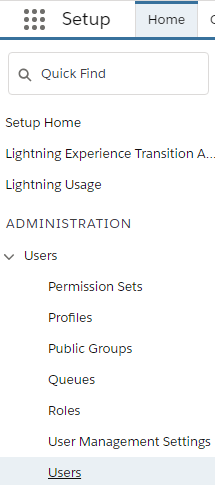

# Set Access and Permissions

Platform Governance for Salesforce access is only granted to system administrations. To extend access to other users:

1. Open Salesforce **Setup** > **Users** > **Users**
2. Click on an existing **User** name.
3. Click **Permission Set Assignments**
4. Click **Edit Assignments**.
5. Select **Strongpoint Grant Permissions** from the **Available Permission Sets**
6. Click **Add**. It should now be shown in the **Enabled Permission Sets**.
7. Click **Save**.

The user is ready to view and use Platform Governance for Salesforce.