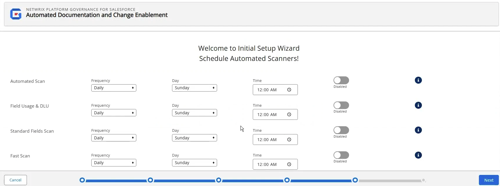
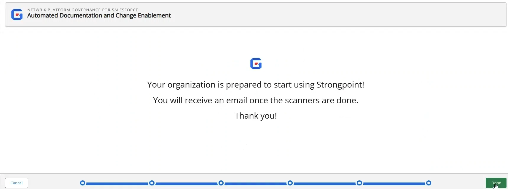

# Set Up the Initial Scan

The Metadata Scanner form is displayed.

## Sandbox Options

:::note
If you are installing in a sandbox, there is an option for Change Log Creation. If Enabled, change logs are created in the sandbox. Due to Salesforce space limits on different sandbox accounts, you may want to disable change logs to save space. This option can also be accessed on the Configuration and Stats page for the sandbox.
:::

Here are the options for a Sandbox installation. Be sure to **Save** each setting you change. Scroll down to find the Scanner options.

## Start Initial Scan

Scroll down to the Metadata Scanner section.

1. Click the + by **Name** to select all types for the initial scan.
2. Click **Run Scanner**. A notification message displays when the scan starts.
3. Click **Next**.

## Schedule Automatic Scans

You can schedule the scanners to auto-scan your environment:

1. Toggle **Enabled** to activate a scan. Hover over the **?** for details on the scan.
2. Select the **Frequency** and **Day**. If you do not specify a time Platform Governance for Salesforce rescans at midnight.

   

   :::note
Netwrix recommends you schedule at least the following items:
   :::

   * **Automated Scan**: Daily
   * **Field Usage & DLU**: Weekly
   * **Standard Fields Scan**: Weekly
   * **PermissionSet Assignment**: Weekly (Production orgs)
   * **Subscriber Users Scan**: Weekly (Production orgs)
3. Click **Next**.

The final screen is displayed. Click **Done** to close the wizard.

If you open the home page, you see the **Scanner Status** is **In Progress**.

**Next Step:** [Run the Scanner](running_scanner "Open the Running the Scanner topic")