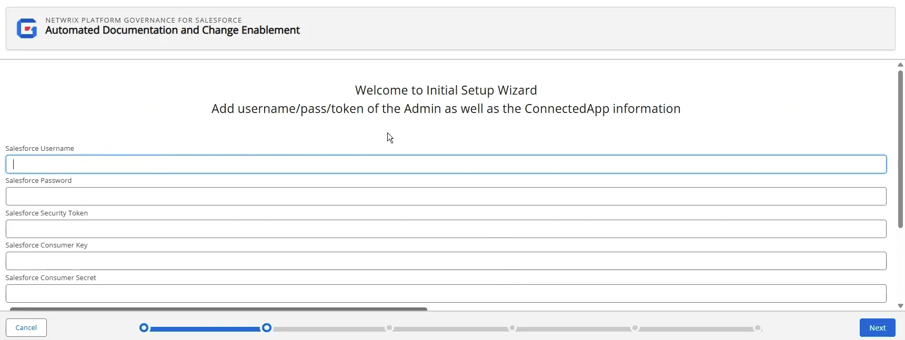

# Run the Getting Started Wizard

The Getting Started Wizard helps you set up Platform Governance for Salesforce after you have done the [basic installation](installing_strongpoint "Open the Installing Strongpoint topic") and configuration.

To use the Getting Started Wizard:

1. Open **Netwrix Dashboard**.
2. Open **Settings**> **Getting Started Wizard**

The **Getting Started Wizard** opens to help you finish the configuration and set up.

## Choose Your License Type

On the Initial Setup Wizard page, choose the package type you have purchased. If you have an Intelligent Change Management or Enterprise Compliance License, enter the **Input Authorization Token** sent to you. Click **Next**.

## Add your Credentials

Once you have chosen your license type, you need to add your credentials. If your credentials change, an alert is sent to update the saved credentials. Expired credentials can cause auto scanners to fail. Use **Netwrix Dashboard** > **Settings**> **SP Credentials** to update your credentials.

1. On the Credentials page, add the following values:

* **Salesforce Username**
* **Salesforce Password**
* **Salesforce Security Token**
* **Salesforce Consumer Key** Extracted when you created the Strongpoint Connected App
* **Salesforce Consumer Secret**  Extracted when you created the Strongpoint Connected App

2. Click **Next**

## Test Your Connection

Once you have set up your credentials, you need to configure the remote site settings.

1. Open Salesforce **Setup** > **Security** > **Remote Site Settings**.
2. Click **New Remote Site**.

   
3. Copy/paste the information from the wizard to create the remote sites.
4. Click on **Test Connection**. **Test connection was Successful** is displayed if the connection succeeds. If the connection fails, the wizard suggests troubleshooting steps to resolve the issue.
5. Click **Next**.
  
  

**Next Step:** [Set Up the Initial Scan](setting_up_initial_scan "Open the Setting Up the Initial Scan topic")