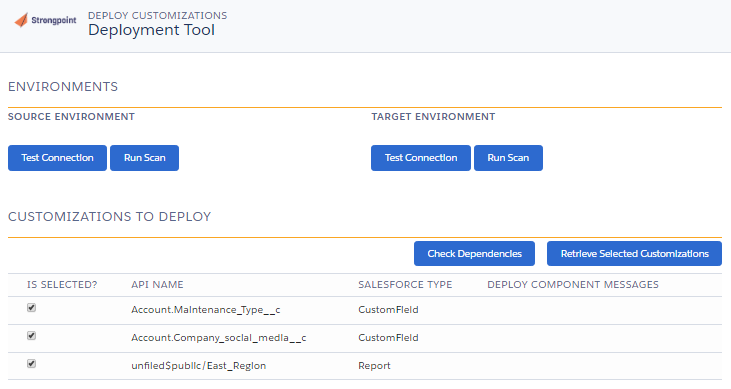
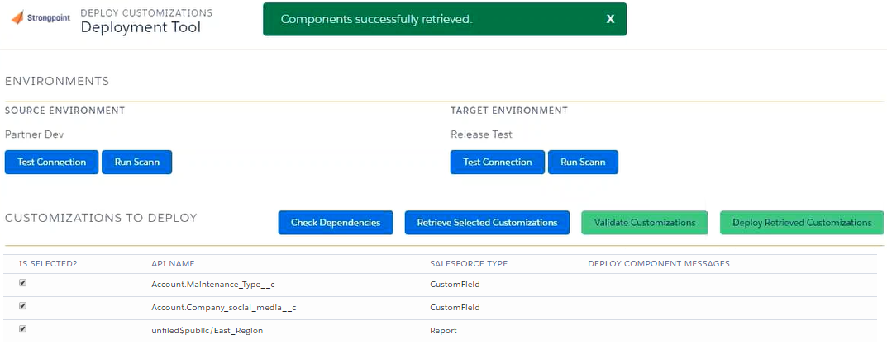

# Deployments

Your deployments can be documented across your test environment(s) to your production environment(s). Each step in the deployment process complies with your policies and a comprehensive approval process. Deployments are blocked if approvals are not complete. A full audit trail of the entire deployment process is maintained.The process is:

> [Create a Change Request](#Create "Create a Change Request")
>
> [Create a Deployment Record](#Create2 "Create a Deployment Record")
>
> [Deploy the Changes](#Deploy "Deploy the Changes")
>
> [Complete the Process](#Complete "Complete the Process")

## Create a Change Request

1. Open **Change Requests** > **New Change Request**
2. Enter a meaningful **Name** and **Change Overview**
3. Modify the **Change Type** as needed. Add any other supporting information, change sets, package manifests, or customizations.
4. **Save** the change request.
5. Click **Submit for Approval**

## Create a Deployment Record

These steps can be completed after the change request is approved.

1. Open **Change Requests** and select the approved change request.
2. Click **Deploy** in the tool bar. **Deploy** is only available for approved change requests.

   
3. Select the **Source** (from) environment and **Target** (to) environment.
4. Enter your credentials for both environments.

   
5. Click **Test Connection** for both environments to ensure your credentials are correct. If your credentials are not correct, you can click on **Save Credentials** and edit.
6. Click **Run Scan** on both environments to ensure the customizations on the change request are up to date.
7. **Save** the Deployment Record.
8. Click **Submit for Approval**

   

## Deploy the Changes

These steps can be completed after the deployment record is approved.

1. Open **Change Requests** and select the approved deployment record.
2. Click **Deploy Changes**

   
3. Click **Retrieve Selected Customizations**

   
     
   This creates a package to:

   * **Check Dependencies**: Use to check what has been referenced.
   * **Validate Customizations**: Use to check the deployment is going to work. It simulates your deployment.
   * **Deploy Retrieved Customizations**: Use to deploy your customizations when you are ready to proceed.
4. Check your dependencies and validate your customizations.
5. Click **Deploy Retrieved Customizations** to start the deployment. This may take some time, since it runs the test cases into the target environment.

   

## Complete the Process

When the deployment process is finished:

1. Check the [Deployment Logs](deployment_logs "Open Deployment Logs topic").
2. Fix any errors and repeat the deployment if needed.
3. Once the deployment is successful, open the change request and set the status to **Completed**.

   