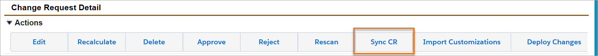
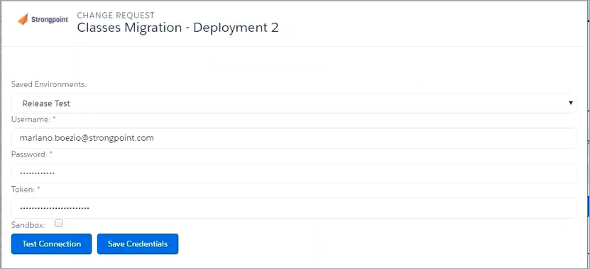
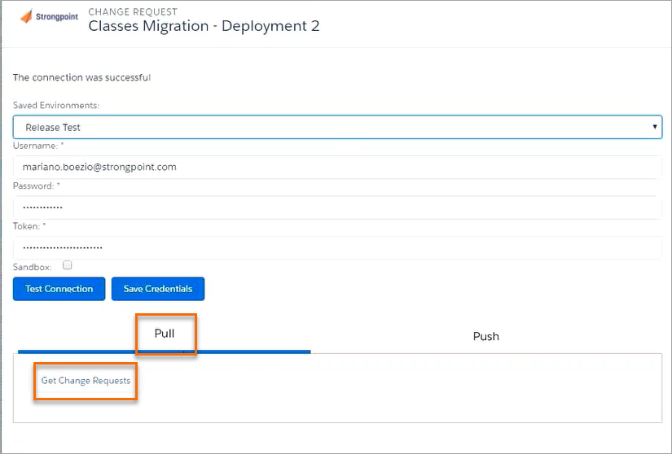

# Multiple Environment Deployments

Multiple Environment Deployment Tracking helps you manage changes between your Production and Development/Testing .

With multiple environment deployment tracking, you can push, pull and access your change requests in all your environments that have Platform Governance for Salesforce installed. This alleviates the risk of breaking your production account. By documenting and validating the change process through change requests, deployment records and environment comparison, multiple environment deployment tracking enables you to access change requests in any environment where Platform Governance for Salesforce is installed, and to deploy changes and promote code from one environment to another.

## Push/Pull Change Requests

1. Open **Change Requests** and locate the completed change request to push/pull.

   
2. Edit the change request and add all necessary details.

   
3. Click on **Sync CR**.

   
4. Choose a **Saved Environment**, where you are planning to push or pull the Change Request.
5. Add your **Credentials**.

   
6. Click on **Test Connection** to make sure your credentials are correct. If your credentials are not correct, you can click on **Save Credentials** and edit.

### Push the Change Request

To push a change request into another environment:

1. Click **Push**.
2. Click  **Push CR**.

   

Your Change Request is pushed to your selected environment.

### Pull the Change Request

To pull a change request from the selected environment:

1. Select **Pull**
2. Click on **Get Change Requests**

   
3. Add the change requests you want to pull from the selected environment.

   
4. Click **Pull Change Request.**

The parent change request is the one you pull from and when the change request is pulled, it becomes a child of the original change request.