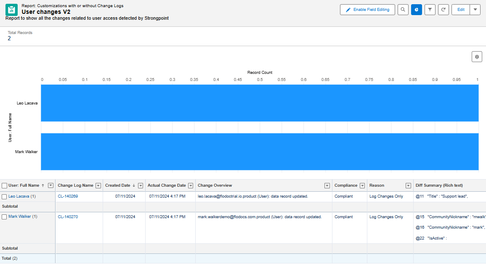

# Reports

The Netwrix Dashboard **Reports** tab has links to all of the predefined reports and log files.

* [Access Reports](#Access "Access Reports")
* [Security Reports](#Security "Security Reports")
* [Data Classification](#Data "Data Classification")
* [Customizations](#Customiz "Customizations")
* [Clean Up](#Clean "Clean Up")
* [Change Enablement](#Change "Change Enablement")
* [Release and Deployment](#Release "Release and Deployment")
* [Audit Reports](#Audit "Audit Reports")

You can define and save your own reports.

* Customization objects have additional data to enable searching with complex queries. For example, search for *all objects with script dependencies that have not been used for six months*, *or all objects used by workflows*.
* You can filter test scripts from regular scripts. Test scripts can be queried to review test coverage and determine if they being used.

:::note
To access all reports, the following setting must be enabled:Open Strongpoint > Scanner > Scheduler PermissionSet Assignment and System Permission must be Enabled, and the Frequency set to Daily. If you have questions, contact your CSM or Salesforce Specialist.
:::

## Access Reports

These reports are available from **Netwrix Dashboard** > **Reports** > **Access Reports**.

Filters can be used on this report. Use **Save As** for a new version following your company naming conventions. An elevated access example is to filter **Permissionset/Profile** by the name of the elevated access profile or permission set, such as **Admin**.

You can focus on sensitive objects by filtering by object name and adding the names of the objects in the filter using the **contains** keyword plus the name of the object as it appears in object name. Separate each name with a comma.

> **Permissions by Object**: Displays the permissions on each object for all Permission Sets and Profiles.
>
> 
>
> **Object Permission by Profile/PermSet**: Displays the object permissions organized by Permission Set and Profile.
>
> 
>
> **Users to Profiles/PermissionSets**: Displays the Profile, PermissionSet and PermissionSet Group assigned to each user. You can filter the report information. For example, if you want a list of users that have Admin profiles, you can set two filters:
>
> * Customization Name Contains **Admin**
> * Salesforce type Equals Profile
>
> :::note
> Date Assigned and Expires on are only relevant for PermissionSets. They are blank for Profiles. If your org does not use the Expires on feature, you can remove the column from the report.
> :::
>
> 
>
> **Profiles to PermissionsSets Changes**: Displays the changes made to your Profiles, PermissionSets,and PermissionSet Groups. If there is an active policy, the **Compliance** column displays whether the change was Compliant or Non-Compliant. If no policy, all changes are Compliant.
>
> 
>
> **Changes to Users**: Displays the changes to tracked user data fields. Refer to [Enhanced CPQ Support](../change_management/enhanced_CPQ_support "Open Enhanced CPQ Support topic") for more information on setting up tracking.
>
> :::note
> If you see the message: --String too long - Skipped lines due to CPU limit reached-- it simply means the governor limits have been reached. Profiles and PermissionSets are very data heavy. Platform Governance for Salesforcet skips the record and continues the scan the next day to ensure there is no impact to your org.
> :::
>
> 
>
> **Record Types and Page Layout Assignments**: Displays the objects, record types and assigned layouts organized by profile.
>
> 
>
> **System Permissions**: displays the list of System Permissions, the Profile or Permission set that has access to it and the list of Users that have this system permission enabled.
>
> 
>
> **Field Permissions**: Displays the related objects, shows if there is a Read / Edit permission, the Profile or Permission set that give that field level access and the users related to those Profiles and permission sets.
>
> 
>
> To generate this report:
>
> 1. Open **Strongpoint Lightning** > **Tools** > **Field-Level security Scanner**.
> 2. Select the Salesforce object for the fields to add to the report.
> 3. Click **Search Fields**.
> 4. Change the checkbox to **True** next to the fields to add. You can add up to 50 fields.
> 5. Click **Scan**.
>
> This pushes the new list of fields to the report. If you select other fields and repeat the process, the previous report is overwritten. Export any reports you want to keep.

## Security Reports

These reports are related to the Salesforce Health Check. It tracks if this feature of the health check is **Enabled** or **Disabled** for your Salesforce Organization. For full detail compare the report to the health check section in Salesforce Setup.

These reports are available from **Netwrix Dashboard** > **Reports** > **Security Reports**.

> **Health Check Remote Site Settings**: displays any remote sites with the **Disable Protocol** security option selected.
>
> **Health Check Password Policies**: displays password related Health check security settings.
>
> **Health Check Session Settings**: displays session settings, including:
>
> * Require HttpOnly attribute.
> * Lock sessions to the domain in which they were first used.
> * Let users verify their identity by text (SMS)
> * Enable clickjack protection for Setup pages
> * Enable clickjack protection for non-Setup Salesforce pages
> * Enable clickjack protection for customer Visualforce pages with standard headers
> * Enable clickjack protection for customer Visualforce pages with headers disabled
> * Enable CSRF protection on GET requests on non-setup pages
> * Enable CSRF protection on POST requests on non-setup pages
> * Force relogin after Login-As-User
> * Enforce login IP ranges on every request
> * Enable Content Security Policy protection for email templates
> * Enable XSS protection
> * Enable Content Sniffing protection
> * Force logout on session timeout
> * Require identity verification for email address changes
> * Session Timeout
> * Require identity verification during multi-factor authentication (MFA) registration
> * Allow redirections to untrusted external URLs without warning
>
> **Health Check Certificates**: tracks CKM Certificate name, Expiration date, expiration status, CKM Key Size and related Policy if applicable.
>
> **Health Check Changes**: tracks the changes to the items related to the health check settings.

## Data Classification

These reports are available from **Strongpoint** > **Reports** > **Data Classification**.

> **Changes related to Data Classification**: displays any changes that have occured.
>
> **Fields with Data Classification**: displays fields with data classification attributes, including:
>
> * GDPR
> * PII
> * HIPAA
> * PCI
> * CCPA

## Customizations

These reports are available from **Netwrix Dashboard** > **Reports** > **Customizations**.

> **All Customizations**: This enables you to use Salesforce functionality to filter searches quickly for specific customizations.
>
> **Customization Impact**: This report shows your customizations and how they impact other objects.

## Clean Up

These reports are available from **Netwrix Dashboard** > **Reports** > **Clean Up**.

> [Default Clean Up List View](../clean_up/cleanup_reports#Default)
>
> [Open Clean Up Status](../clean_up/cleanup_reports#Open)
>
> [Clean Up Waiting for Info](../clean_up/cleanup_reports#Clean2)
>
> [Customizations Excluded from Clean Up](../clean_up/cleanup_reports#Customiz4)
>
> [Unused Fields](../clean_up/cleanup_reports#Unused)
>
> [Unused Apex Code](../clean_up/cleanup_reports#Unused4 "Unused Apex Code")
>
> [Unused Reports](../clean_up/cleanup_reports#Unused3)
>
> [Customizations with Inactive Owners](../clean_up/cleanup_reports#Inactive)
>
> [Customizations without Related Processes](../clean_up/cleanup_reports#Customiz)
>
> [Custom Fields without Help Text](../clean_up/cleanup_reports#Customiz2)
>
> [Custom Fields without Description](../clean_up/cleanup_reports#Customiz3)

## Change Enablement

These reports are available from **Netwrix Dashboard** > **Reports** > **Change Enablement**.

> **Approval Override**: shows all changes approved with an approval override.
>
> **What Changed?**: shows all changes that have occurred.
>
> **Unresolved Non-Compliant Changes**: displays open non-compliant changes. A non-compliant change indicates something was changed without the required approvals. By looking at this report, you can investigate changes and get an understanding of what the impacts are and see if any additional changes need to be made. This report is used to track changes that require action.
>
> **Managed Package Updates**: displays managed package update details for auditing.
>
> **Resolved Non-Compliant Changes**: displays resolved non-compliant changes with the change overview and the difference summary.
>
> **Compliant Changes**: displays all compliant changes. Compliant changes are automatically marked as closed. This report is used to review changes that have been automatically cleared.
>
> **Consolidated Change By Type**: displays changes summarized and grouped by Salesforce Type.
>
> **Deployed Changes**: displays an end to end summary of deployed changes to enable tracking and reporting of changes to the system.
>
> **Data Tracking Change Logs**: displays changes on objects set for data tracking.
>
> **Change/Approval Policy Changes**: this report is based on Field History Tracking. You can track up to 20 fields from the Policy Record. Salesforce starts tracking field history from the date and time you turn it on a field.
>
> **Fast Scan for Permissions Changes**: displays all changes detected in PermissionSet, PermissionSetGroup, and Profiles by the Fast Scan.

## Release and Deployment

These reports are available from **Netwrix Dashboard** > **Reports** > **Release and Deployment**.

> [Success Deployments](deployment_logs_success)
>
> [Deployments with Failures](deployment_logs_failures)
>
> [Deployments Pending Approval](deployment_logs_pending_approval)
>
> [Rollback Logs](deployment_logs_rollback)

## Audit Reports

**Unresolved Non-Compliant Changes**: displays open non-compliant changes. A non-compliant change indicates something was changed without the required approvals. By looking at this report, you can investigate changes and get an understanding of what the impacts are and see if any additional changes need to be made. This report is used to track changes that require action.

**Managed Package Updates**: displays managed package update details for auditing.

**Resolved Non-Compliant Changes**: displays managed package update details for auditing.

**Compliant Changes**: displays all compliant changes. Compliant changes are automatically marked as closed. This report is used to review changes that have been automatically cleared.

**Platform Changes**: displays any platform changes that have occured.

**Consolidated Changes By Type**: displays changes summarized and grouped by Salesforce Type.

**Deployed Changes**: displays an end to end summary of deployed changes to enable tracking and reporting of changes to the system.

**Unresolved Control Incidents**: Deprecated item

**Resolved Control Incidents**: Deprecated item

**Pre-Approved Control Incidents**: Deprecated item