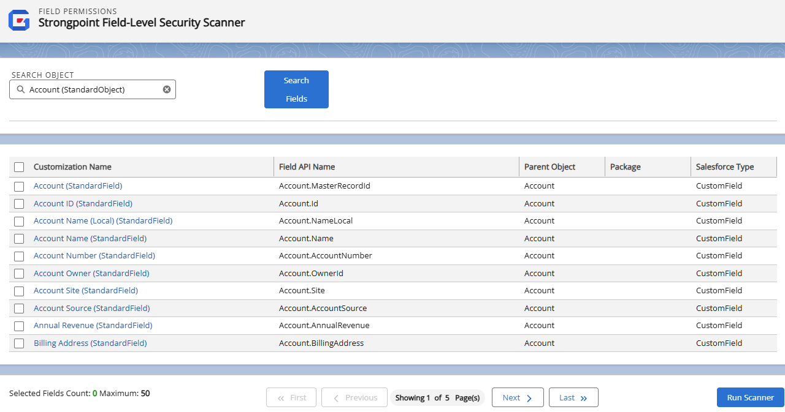
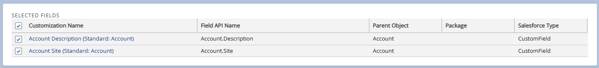

# Field Level Security Scanner

The Field Level Security Scanner creates a comprehensive list of Customizations, Field API Name, Parent Object, Package, and Salesforce Type for a selected Object.

:::note
Run the scanners before you search to ensure you have the latest data.
:::

1. Open **Netwrix Dashboard** > **Scanner** > Field-Level Security Scanner.

   
2. Start typing the name of a **Salesforce Object**. Pick from the completion list.
3. Click **Search Fields**.

   
4. Select one or more fields to scan. The **Customization Name** is a link to the Customization Record.

   **NOTE:**  It is not technically possible to scan permissions on all fields in each object.
5. Selected fields are shown in a list at the bottom of the form. You can uncheck individual fields or all fields from the **Selected Field** list.

   
6. Click **Run Scanner**.

:::note
Once the scan is complete, open the Reports tab and select Field Permissions Report. The report is also available from the Netwrix Dashboard: Reports > Access Reports > Field Permissions.
:::

:::note
:::