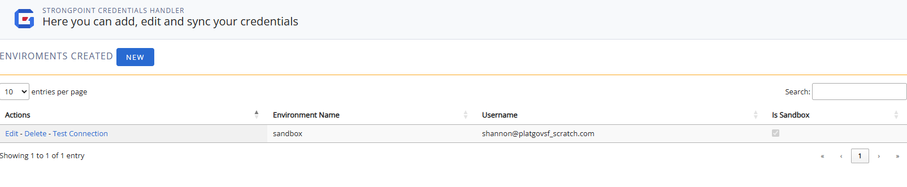

# Credentials

Credentials organizes your user credentials across all environments It is available from **Netwrix Dashboard** > **Settings** > **SP Credentials**

You must create a Connected App to run the scanner. Refer to [Install Platform Governance for Salesforce](../installing_strongpoint/installing_strongpoint#connectedApp) for instructions.

Click **New** to add a new credential or **Edit** and existing credential. **Search** finds and filters information from the current credentials list.

Use the **Test Connection** to verify your credentials.

Click **Save** when complete.

## Credentials for Environment Comparison

When you follow the **Click here to proceed** link on the Environment Comparison tool, it opens the Credentials Handler where you can add, edit and sync your credentials.

Click **New** to add a new credential or **Edit** and existing credential. **Search** finds and filters information from the current credentials list.

1. Enter or edit the environment and credential information. Check **Sandbox** if applicable.
2. Click **Save**.
3. Click **Test Connection**. A banner is displayed indicating either success or an error with the credentials.