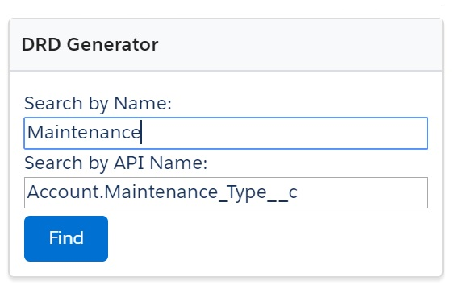
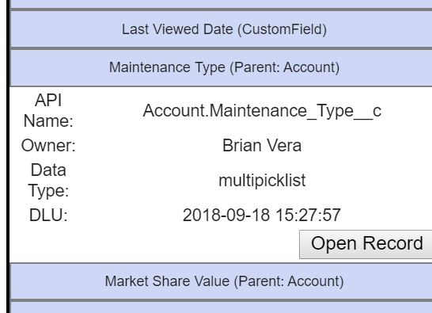

# Automated Documentation

Great documentation is easy with Platform Governance for Salesforce. Install the managed package in a sandbox or production org and start the scanners.Platform Governance for Salesforce continuously maintains automated digital documentation of each Salesforce org and provides easy to understand diagrams and clean up tools. You can print or export results for offline reference.

> **TIP**
>
> **Learning About the Scanners**: Review the [Running the Scanner](../installing_strongpoint/running_scanner "Open the Running the Scanner topic") topic or reach out to the Customer Success team. It takes half an hour or so to get set up and on your way.
>
> The scanning process is a function of size: smaller orgs index in only a few hours, while large orgs can take up to 5 days.
>
> Platform Governance for Salesforce is a 100% native Salesforce App. Our records and code usage DO NOT count against your governance limits. Moreover, once the initial scan is complete, Platform Governance for Salesforce automatically updates documentation relating only to things that have changed, greatly reducing the amount of time required to scan.

Once your orgs are documented, understanding the downstream dependencies of any change is a straightforward, simple process. There are a number of ways to do this:

> [Dependency Relationship Diagram (DRD)](#Dependen)
>
> [Customization Record](#Customiz)
>
> [Finder](#Finder)
>
> [Object Exporter](#Object)
>
> [Reports and List Views](#Reports)

## Dependency Relationship Diagram (DRD)

The [DRD](../tools/viewing_drd "Open the Viewing the DRD topic") is a graphical presentation of an object to help you visualize the dependencies.

1. The DRD can be launched from both the Home tab and the Tools menu. Open **Netwrix Dashboard** > **Tools** > **Dependency Relationship Diagram**, and select an object from the list.

   

   From the **Netwrix Dashboard** tab, use the **DRD Generator** to launch the DRD for a particular Customization. You can search by **Name** or **API Name**.

   
2. Click an attribute to expand the metadata record and view all the dependencies. Drill down for details so you can fully understand the downstream dependencies.

   
3. The DRD exposes other critical metadata such as the Owner, API Name, Data Type, and Date Last Used (DLU). This data expedites clean up, enabling you to filter and group Customizations in List Views or Reports.

   
4. Click **Open Record** to open the full Customization Record with complete access to the detailed metadata and change history for the Customization.

> **PRO TIPS**
>
> * Read more about the [Customization Record](../customizations/customizations_overview "Open the Customizations Overview topic").
> * Click **Show/Hide Standard Fields** to toggle displaying Standard Fields in the DRD.

## Customization Record

The Customization record is the heart of Platform Governance for Salesforce’s automated documentation — all of the gathered metadata is organized into an easy to understand format. Each Customization record includes the information you expect from excellent documentation:

* What the customization is
* What it is part of
* What it depends upon
* What depends on it
* When it was last used
* Who owns it
* Who created it
* Other metadata to help change agents understand it, such as formulas, filters and API calls if relevant

If you have Intelligent Change Enablement, you also see:

* Change history

The tabs on each Customization record break out the information you need to fully understand the basic metadata, dependencies by type and change history (requires *Intelligent Change Enablement* or *Enterprise Compliance* [license](../installing_strongpoint/features_by_license_type "Open Features by License Type topic")). Click **Go To Record** to open the actual Salesforce record for users with proper access. Customization records can be edited to assist in organizing records for clean up and optimization.

Here are five methods to access Customizations to explore:

* Open the DRD to get the object overview or investigate the fields on an object.
* Enter a Customization name in the main **Search Salesforce** bar. All Customization records are searchable and include the **DRD** tab.
* **Customizations** tab: Navigate like any other record to see different views, such as recently changed Customizations.
* **Finder** is another powerful tool for searching and visualizing relationships between Customizations.
* Create your own Dashboards, Reports and List Views to get exactly what you want. Platform Governance for Salesforce is a native Salesforce app, so you can use all your skills to create exactly what you need.

## Finder

[Finder](../tools/finder "Open the Finder topic") is another flexible tool for understanding dependencies across objects. You can search for Customizations by:

* Text / API Name
* Creation Date
* Date Last Used (DLU)
* Creator / Owner
* Customization Type

You can **Include** or **Exclude** Package Customizations to filter your lists. Results can be exported in PDF or Excel formats.

## Object Exporter

Object Exporter enables exporting information about entire objects, profiles or users into Excel for further research. Read more on [Exporting Objects](../tools/export_objects "Open the Exporting Objects topic"), [Exporting Profiles](../tools/export_profiles "Open the Exporting Profiles topic") and [Exporting Users](../tools/export_users "Open the Exporting Users topic").

## Reports and List Views

Platform Governance for Salesforce is fully built into Salesforce so you can take advantage our our libraries of List Views and Reports or build your own.

**Next Technical Debt Topic:** [Change Monitoring](tech_debt_change_monitoring "Open the Change Monitoring topic")