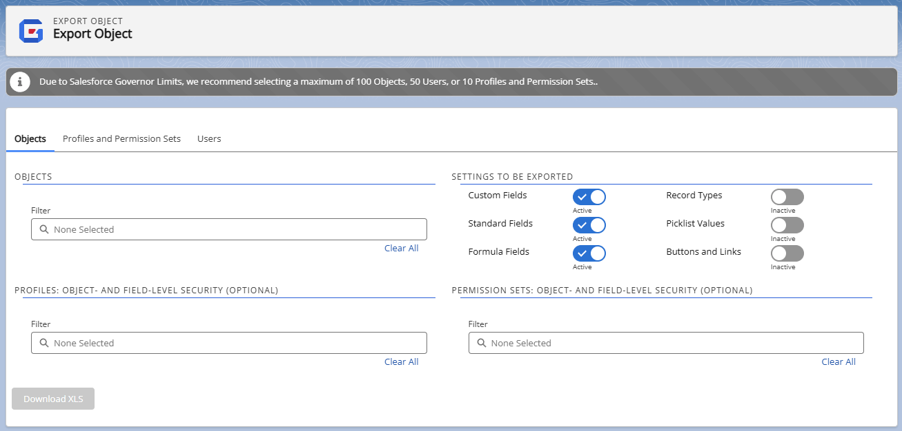
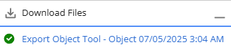

# Export Objects

Administrators can use this to export one or more objects, including all child objects, into a single view for easy review and management. For each export, you select the settings and optional profiles and permission sets to include in the object details. The export is done in the background to avoid timing out or exceeding the Salesforce Governor Limits. You will receive an email with a link to the [Export Object Attachment](export_object_attachment_records "Open Export Object Attachment record") record, where you can download your file. You can also use the **Download Files** link on this page or on the Netwrix Dashboard to download your file.

:::note
Platform Governance for Salesforce stores Object-level permissions in a Custom Object. There are two reports (Netwrix Dashboard > Reports > Access Reports) for easy access to this information:
:::

> **Permissions by Object**
>
> **Object Permissions by Profile/PermSet**

Open **Netwrix Dashboard** > **Tools** > **Export Objects**  
**Objects** is the default tab.

Objects

Enter all or part of a name in **Filter** to filter the list of objects.

Select one or more objects in the list. Selected options are shown below the filter. Click the **X** within the selected option to remove it. You can use the **Select All** and **Clear All** options.

Settings to be Exported

Click the toggles to activate or inactivate the settings you want to export.

Profiles: Object and Field Level Security (Optional)

Enter all or part of a name in **Filter** to filter the list of profiles.

Select one or more profiles in the list. Selected options are shown below the filter. Click the **X** within the selected option to remove it. You can use the **Select All** and **Clear All** options.

Permission Sets: Object and Field Level Security (Optional)

Enter all or part of a name in **Filter** to filter the list of permission sets.

Select one or more permission sets in the list. Selected options are shown below the filter. Click the **X** within the selected option to remove it. You can use the **Select All** and **Clear All** options.

Download XLS

Click **Download XLS** to export your selections. An email is sent with a link to the file *Object\_Export.xls*.

Download Files

Click **Download Files** to see a list of generated files. The file does not appear in the list until it is complete.

Click on the export name. The Export Attachments tab is opened, showing the attachment detail for your file. Click **View file** to download it to your Downloads folder.

### ObjectExport.xls File

When you open an exported file, this message may be displayed, as the exported *ObjectExport.xls* file is in XML instead of the Excel format. Click **Yes** to load the file.

The *ObjectExport.xls* file contains a **Summary** tab and a separate tab for each selected object.

The **Summary** tab shows who created the export, the creation date and time, list of selected objects, and lists of any selected optional Profiles and Permission Sets.

The **Object** tabs contain all of the requested information for each object.

