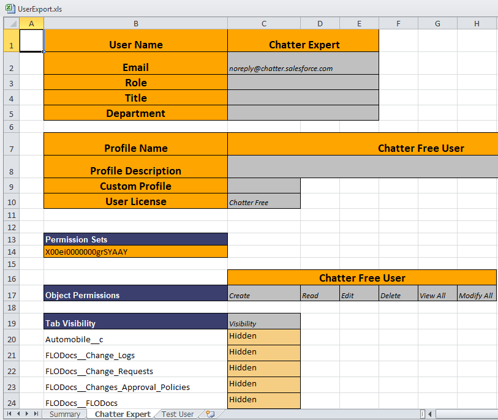

# Export Users

Exports user information to an XLS file.

Administrators can use this tool to export all user information into a single view for easy review and management. The export is done in the background to avoid timing out or exceeding the Salesforce Governor Limits. You receive an email with a link to the [Export Object Attachment](export_object_attachment_records "Open Export Object Attachment record") record, where you can download your file.

1. Open **Netwrix Dashboard** > **Tools** > **Export Objects**
2. Open the **Users** tab.

   
3. Scroll through the **Select User to be Exported** or enter all of part .of a user name in the **Filter** field.
4. Select one or more objects in the scroll box. Use **Shift** or **Ctrl** to select multiple objects.
5. Click the right arrow to move the items to the **Selected Users** list. To remove an item from the **Selected Users** list, select it and click the left arrow.
6. Select the **Settings to be exported**.

   
7. Click **Download XLS**. The file *UserExport.xls* is created.

#### UserExport.xls File

When you open an exported file, this message may be displayed, as the exported *UserExport.xls* file is in XML instead of the Excel format. Click **Yes** to load the file.

The *UserExport.xls* file contains a **Summary** tab and a separate tab for each selected user.

The **Summary** tab shows who created the export, the creation date and time, and the list of selected users.

The **User** tabs contain all of the requested information for each exported user.

